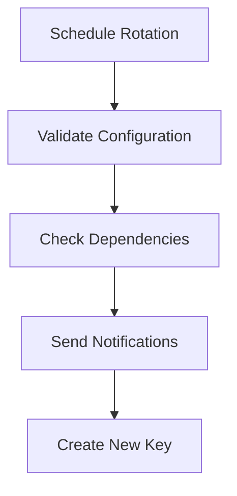
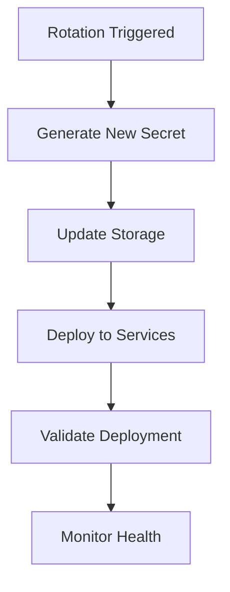
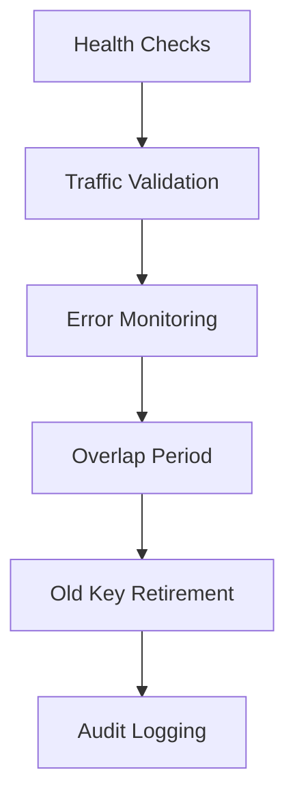

# API Key Rotation Workflow

## Overview

Vortex Secure implements a comprehensive API key rotation system designed to maintain security while ensuring zero-downtime secret management. This document outlines the rotation workflow, implementation details, and placeholder configurations.

## Core Concepts

### Rotation Types

1. **Scheduled Rotation**: Automatic rotation based on time intervals
2. **Manual Rotation**: User-initiated rotation via CLI or dashboard
3. **Emergency Rotation**: Immediate rotation due to security incidents
4. **Phased Rotation**: Gradual rollout with overlap periods

### Key Components

- **Rotation Scheduler**: Manages timing and triggers rotation events
- **Overlap Window**: Period where old and new keys are both valid
- **Notification System**: Alerts stakeholders of upcoming rotations
- **Rollback Mechanism**: Ability to revert to previous keys if needed

## Rotation Workflow

### Phase 1: Preparation



1. **Schedule Creation**:
   ```typescript
   // Example: Schedule database password rotation
   await scheduler.scheduleRotation('database_url', '30d', {
     overlapHours: 48,           // 48-hour overlap window
     notificationWebhooks: [     // Notify services
       'https://api.myapp.com/webhooks/rotation'
     ],
     autoApprove: true,          // Auto-approve for non-critical secrets
     riskLevel: 'medium'
   });
   ```

2. **Dependency Validation**:
   - Check which services use the secret
   - Validate service health before rotation
   - Ensure backup systems are ready

3. **Notification Dispatch**:
   ```json
   {
     "event": "secret.rotation.scheduled",
     "secret_id": "db_password_001",
     "scheduled_time": "2024-01-15T10:00:00Z",
     "overlap_window": "48h",
     "affected_services": ["web_app", "api_gateway", "worker"]
   }
   ```

### Phase 2: Rotation Execution



1. **New Secret Generation**:
   ```typescript
   // Generate cryptographically secure secret
   const newSecret = await crypto.generateSecureToken({
     length: 32,
     charset: 'alphanumeric'
   });

   // For service-specific keys (Stripe, GitHub, etc.)
   const newKey = await serviceApi.generateKey({
     permissions: existingPermissions,
     metadata: { rotated_from: oldKeyId }
   });
   ```

2. **Storage Update**:
   ```sql
   -- Update with new encrypted value
   UPDATE mcp_api_keys
   SET
     key_hash = $new_hash,
     encrypted_key = $encrypted_new_key,
     last_rotated_at = NOW(),
     previous_key_hash = key_hash,
     rotation_status = 'rotating'
   WHERE id = $key_id;
   ```

3. **Service Deployment**:
   ```typescript
   // Deploy to affected services
   await deploymentManager.deploySecret({
     secretId: keyId,
     newValue: newSecret,
     services: affectedServices,
     strategy: 'rolling' // or 'blue-green'
   });
   ```

### Phase 3: Validation & Cleanup



1. **Health Validation**:
   ```typescript
   // Comprehensive health check
   const healthResult = await healthChecker.validateRotation({
     secretId: keyId,
     services: affectedServices,
     metrics: {
       errorRateThreshold: 0.01,    // 1% error rate max
       latencyThreshold: 200,       // 200ms max latency
       successRateThreshold: 0.99   // 99% success rate min
     }
   });
   ```

2. **Overlap Management**:
   ```typescript
   // During overlap period, both keys are valid
   const overlapEnd = new Date(rotationStart.getTime() + overlapHours * 60 * 60 * 1000);

   // Monitor usage of both keys
   const usageStats = await monitor.trackKeyUsage({
     oldKeyId,
     newKeyId,
     period: overlapHours
   });

   // Decide retirement strategy based on usage
   if (usageStats.oldKeyUsage === 0) {
     await retireKey(oldKeyId);
   } else {
     await extendOverlap(overlapHours * 2);
   }
   ```

## Implementation Details

### Database Schema

```sql
-- Rotation tracking table
CREATE TABLE secret_rotations (
  id UUID PRIMARY KEY DEFAULT gen_random_uuid(),
  secret_id UUID REFERENCES mcp_api_keys(id),
  rotation_type TEXT CHECK (rotation_type IN ('scheduled', 'manual', 'emergency')),

  -- Timing
  scheduled_at TIMESTAMP WITH TIME ZONE,
  started_at TIMESTAMP WITH TIME ZONE,
  completed_at TIMESTAMP WITH TIME ZONE,

  -- Configuration
  overlap_hours INTEGER DEFAULT 48,
  auto_approve BOOLEAN DEFAULT false,

  -- Status tracking
  status TEXT CHECK (status IN ('scheduled', 'running', 'completed', 'failed', 'rolled_back')),
  error_message TEXT,

  -- Audit
  initiated_by UUID REFERENCES auth.users(id),
  approved_by UUID REFERENCES auth.users(id),
  created_at TIMESTAMP WITH TIME ZONE DEFAULT NOW()
);
```

### CLI Commands

```bash
# Schedule rotation
vortex schedule database_url 30d --overlap-hours 48 --notify-webhook https://api.example.com/rotation

# Manual rotation
vortex rotate api_key --immediate

# Check rotation status
vortex rotations --overdue
vortex rotations database_url

# Emergency rotation (invalidates all sessions)
vortex rotate compromised_key --emergency --invalidate-sessions
```

### API Endpoints

```typescript
// Schedule rotation
POST /api/secrets/{id}/rotation
{
  "frequency": "30d",
  "overlap_hours": 48,
  "notification_webhooks": ["https://api.example.com/hook"],
  "auto_approve": true
}

// Execute rotation
POST /api/secrets/{id}/rotation/execute

// Get rotation status
GET /api/secrets/{id}/rotation

// Rollback rotation
POST /api/secrets/{id}/rotation/rollback
{
  "reason": "Service compatibility issues"
}
```

## Placeholder Implementations

### Current Placeholder Status

The rotation system currently has these placeholders that need implementation:

#### 1. Rotation Scheduler (Partially Implemented)
```typescript
// Current placeholder in CLI
async scheduleRotation(name: string, frequency: string, options: any): Promise<void> {
  console.log(chalk.yellow('🚧 Schedule rotation feature coming soon'));
}

// TODO: Implement actual scheduling
- Database persistence of schedules
- Cron job integration
- Notification webhook delivery
- Calendar integration for business hours
```

#### 2. Health Validation (Placeholder)
```typescript
// Current implementation returns mock results
const healthResult = await healthChecker.validateRotation(params);

// TODO: Implement real health checks
- Service endpoint monitoring
- Error rate analysis
- Performance metric validation
- Dependency health checks
```

#### 3. Service Deployment (Placeholder)
```typescript
// Current implementation logs intent
await deploymentManager.deploySecret(params);

// TODO: Implement actual deployment
- Kubernetes secret updates
- Docker container restarts
- Cloud service configuration updates
- CDN cache invalidation
```

### Implementation Priority

#### High Priority (Security Critical)
1. **Emergency Rotation**: Immediate key invalidation
2. **Health Validation**: Ensure services remain functional
3. **Audit Logging**: Complete rotation history
4. **Rollback Mechanism**: Ability to revert changes

#### Medium Priority (Operational)
1. **Notification System**: Webhook and email alerts
2. **Scheduling Engine**: Automated rotation triggers
3. **Overlap Management**: Intelligent key retirement
4. **Deployment Integration**: Service-specific deployment strategies

#### Low Priority (Enhancement)
1. **Calendar Integration**: Business hours scheduling
2. **Dependency Analysis**: Impact assessment before rotation
3. **Testing Framework**: Automated rotation testing
4. **Reporting Dashboard**: Rotation analytics and insights

## Security Considerations

### Access Control
- **RBAC**: Only authorized users can schedule rotations
- **Approval Workflow**: High-risk rotations require approval
- **Audit Trail**: Complete logging of all rotation activities

### Risk Mitigation
- **Overlap Windows**: Prevent service disruption
- **Health Monitoring**: Automatic rollback on failures
- **Gradual Rollout**: Canary deployments for critical systems
- **Backup Keys**: Always maintain previous key during transition

### Compliance
- **Retention Policies**: How long to keep old keys
- **Notification Requirements**: Regulatory compliance for key changes
- **Documentation**: Automated documentation of rotation events

## Monitoring & Alerting

### Metrics to Track
- Rotation success/failure rates
- Service disruption duration
- Manual intervention frequency
- Rotation schedule adherence

### Alerts
- Failed rotations
- Overdue scheduled rotations
- High-risk rotation approvals needed
- Service health degradation during rotation

## Future Enhancements

### Advanced Features
1. **Predictive Rotation**: ML-based optimal rotation timing
2. **Blue-Green Rotation**: Zero-downtime rotation with traffic shifting
3. **Multi-Region Rotation**: Coordinated rotation across regions
4. **Integration Testing**: Automated testing before rotation

### Integration Points
1. **CI/CD Pipeline Integration**: Automatic rotation in deployment pipelines
2. **Infrastructure as Code**: Rotation policies in Terraform/CloudFormation
3. **Service Mesh Integration**: Istio, Linkerd rotation integration
4. **GitOps Integration**: ArgoCD, Flux rotation workflows

This comprehensive rotation system ensures security while maintaining service availability through careful planning, validation, and monitoring throughout the entire rotation lifecycle.